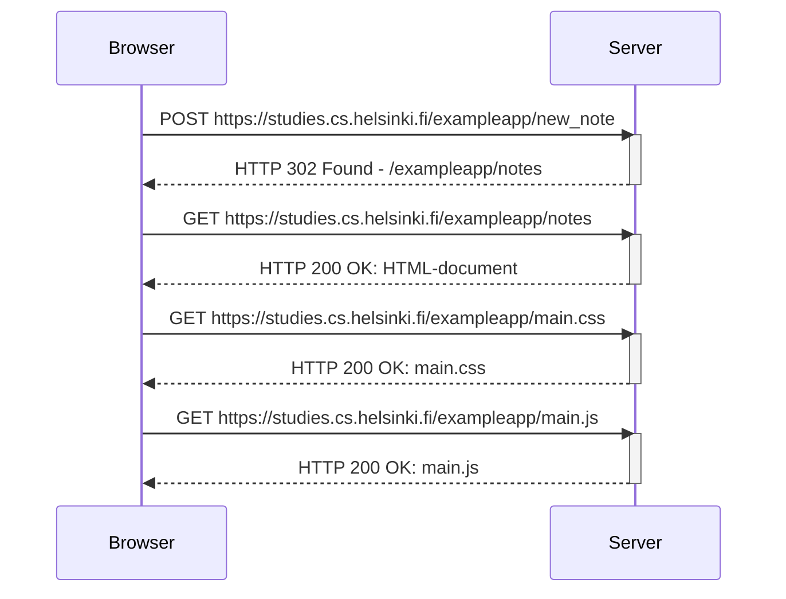

# Part0: Exercise 4

```mermaid
sequenceDiagram
	participant B as Browser
	participant S as Server

	B->>S: POST https://studies.cs.helsinki.fi/exampleapp/new_note
	activate S
	S-->>B:  HTTP 302 Found - /exampleapp/notes
	deactivate S
	
	B->>S: GET https://studies.cs.helsinki.fi/exampleapp/notes
	activate S
	S-->>B:  HTTP 200 OK: HTML-document
	deactivate S

	B->>S: GET https://studies.cs.helsinki.fi/exampleapp/main.css
	activate S
	S-->>B:  HTTP 200 OK: main.css
	deactivate S

	B->>S: GET https://studies.cs.helsinki.fi/exampleapp/main.js
	activate S
	S-->>B:  HTTP 200 OK: main.js
	deactivate S

```
