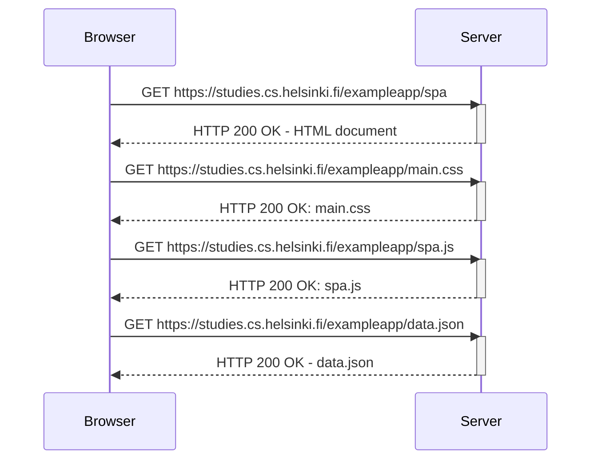

# Part0: Exercise 5

```mermaid
sequenceDiagram
	participant B as Browser
	participant S as Server

	B->>S: GET https://studies.cs.helsinki.fi/exampleapp/spa
	activate S
	S-->>B:  HTTP 200 OK - HTML document
	deactivate S
	
	B->>S: GET https://studies.cs.helsinki.fi/exampleapp/main.css
	activate S
	S-->>B:  HTTP 200 OK: main.css
	deactivate S

	B->>S: GET https://studies.cs.helsinki.fi/exampleapp/spa.js
	activate S
	S-->>B:  HTTP 200 OK: spa.js
	deactivate S
	
	B->>S: GET https://studies.cs.helsinki.fi/exampleapp/data.json
	activate S
	S-->>B:  HTTP 200 OK - data.json
	deactivate S
```
