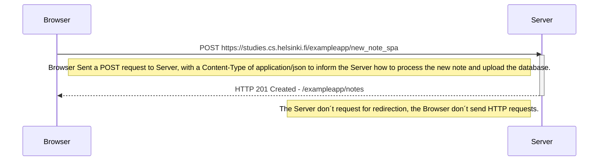

# Part0: Exercise 6

```mermaid
sequenceDiagram
	participant B as Browser
	participant S as Server

	B->>S: POST https://studies.cs.helsinki.fi/exampleapp/new_note_spa
	activate S
	Note right of B: Browser Sent a POST request to Server, with a Content-Type of application/json to inform the Server how to process the new note and upload the database.
	S-->>B:  HTTP 201 Created - /exampleapp/notes
	deactivate S

	Note left of S: The Server don´t request for redirection, the Browser don´t send HTTP requests.
	
	

```
